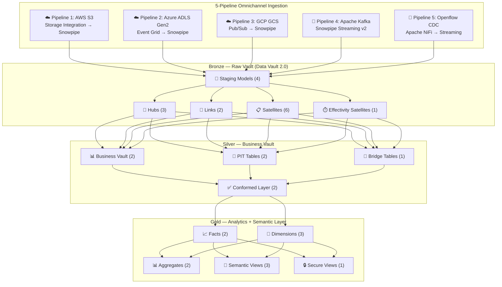

<p align="center">
  
  
  
  
  
  
</p>

# 🏗️ SnowVault Enterprise — Multi-Cloud Snowflake Data Platform

A **production-grade, enterprise-level, multi-cloud data platform** on Snowflake implementing **Data Vault 2.0** with **Medallion architecture**, **5-pipeline omnichannel ingestion** (AWS S3, Azure ADLS Gen2, GCP GCS, Kafka Streaming v2, Openflow CDC), **Dagster** orchestration, **Terraform** IaC, and **Snowflake Horizon** governance — deployed across **5-7 regions** spanning AWS, Azure, and GCP.

---

## 🏛️ Architecture



---

## 📁 Project Structure (129 files)

```
data_vault_2_0/
├── terraform/                          # Infrastructure as Code
│   ├── modules/                        # 7 reusable modules (DBs, WHs, RBAC, etc.)
│   │   ├── databases/                  # 4 databases + schemas
│   │   ├── warehouses/                 # 5 workload-isolated warehouses
│   │   ├── rbac/                       # 6 roles + hierarchy + TF service account
│   │   ├── storage_integrations/       # S3 + ADLS + GCS (conditional)
│   │   ├── replication/                # Failover groups (dangling ref safe)
│   │   ├── network_policies/           # IP restriction
│   │   └── resource_monitors/          # FinOps credit caps
│   └── environments/dev/              # Dev environment config
├── snowflake/                          # 15 Bootstrap SQL scripts (00-14)
├── dagster/                            # Primary Orchestrator (Software-Defined Assets)
│   ├── assets/                         # Bronze, Silver, Gold, Ingestion assets
│   ├── definitions.py                  # Single entry point
│   ├── sensors.py                      # CDC + Replication lag sensors
│   ├── jobs.py, schedules.py          # 4 jobs, 4 schedules
│   └── resources.py                    # Snowflake + dbt connections
├── airflow/dags/                       # 5 Airflow DAGs (alternative orchestrator)
├── models/
│   ├── sources/                        # 3 source definitions
│   ├── bronze/                         # Raw Vault: staging, hubs, links, satellites
│   ├── silver/                         # Business Vault, PIT, Bridge, Conformed
│   └── gold/                           # Facts, Dimensions, Aggregates, Secure Views
├── macros/                             # 14 macros (DV, ingestion, governance, utils)
├── tests/                              # 7 tests (3 generic + 4 layer-specific)
├── seeds/                              # 4 reference data CSVs + schema
├── snapshots/                          # SCD Type 2 snapshots
├── analyses/                           # Vault health + SLA monitor
├── .github/workflows/                  # 3 CI/CD pipelines
├── docs/                               # Architecture & engineering documentation
└── runbooks/                           # Operational playbooks
```

---

## ⚡ Tech Stack

| Layer | Technology | Purpose |
|---|---|---|
| **Data Warehouse** | Snowflake (Business Critical+) | Multi-cloud AI Data Cloud |
| **Data Modeling** | Data Vault 2.0 + Medallion | Auditable, scalable enterprise model |
| **Transformation** | dbt (dbt-snowflake) | SQL-first ELT with Jinja templating |
| **DV Automation** | dbtvault (automate-dv) | Hub/Link/Satellite code generation |
| **Orchestration** | Dagster (primary) + Airflow (alt) | Software-Defined Assets |
| **IaC** | Terraform (snowflakedb provider) | RSA key-pair auth, modular provisioning |
| **Ingestion** | Snowpipe + Streaming v2 + Openflow | 5-pipeline omnichannel |
| **Streaming** | Apache Kafka + Snowpipe Streaming | Sub-second direct row ingest |
| **CDC** | Snowflake Openflow (Apache NiFi) | WAL/redo log operational DB replication |
| **Governance** | Snowflake Horizon Catalog | Tags, masking, RAPs, classification |
| **Semantic Layer** | Snowflake Semantic Views | AI-ready metrics for Cortex AI |
| **CI/CD** | GitHub Actions | Slim CI, test gates, Terraform plan/apply |
| **Data Quality** | dbt_expectations + custom tests | Generic + layer-specific DQ checks |
| **DR** | Failover Groups + Client Redirect | 3 continuity strategies, tiered replication |

---

## 🚀 Quick Start

```bash
# 1. Clone
git clone https://github.com/hsg09/data_vault_2_0.git && cd data_vault_2_0

# 2. Install
pip install -e ".[dev]"

# 3. Configure (See docs/infrastructure_setup.md for prerequisites)
cp .env.example .env   # Edit with your Snowflake credentials

# 4. Bootstrap Snowflake (scripts 00-14 in order)
# Execute snowflake/00_rbac_setup.sql → 14_enhanced_failover_runbooks.sql

# 5. Install dbt packages
dbt deps --profiles-dir .

# 6. Validate connection
dbt debug --profiles-dir .

# 7. Load reference data
dbt seed --profiles-dir .

# 8. Run full pipeline (Bronze → Silver → Gold)
dbt run --profiles-dir .

# 9. Run tests
dbt test --profiles-dir .

# 10. Generate documentation
dbt docs generate --profiles-dir . && dbt docs serve --profiles-dir .
```

---

## 📋 Prompt Compliance Matrix

| Requirement | Status | Implementation |
|---|---|---|
| **Multi-source Ingestion (3-4 pipelines)** | ✅ 5 pipelines | S3, ADLS, GCS, Kafka Streaming v2, Openflow CDC |
| **Medallion Architecture** | ✅ | Bronze (Raw Vault) → Silver (BV) → Gold (Star Schema) |
| **Data Vault 2.0** | ✅ | 3 Hubs, 2 Links, 6 Sats, 1 Eff Sat, PITs, Bridges |
| **Modern Data Stack** | ✅ | dbt, Dagster, Terraform, GitHub Actions, Snowflake Horizon |
| **Multi-Cloud (5-7 regions)** | ✅ | AWS + Azure + GCP with Failover Groups + Client Redirect |
| **CI/CD & DevOps** | ✅ | Slim CI, test gates, Terraform plan/apply, weekly DQ reports |
| **High Availability & DR** | ✅ | 3 continuity strategies, tiered replication, Client Redirect |
| **Data Residency Compliance** | ✅ | Row Access Policies, country-based filtering, data classification |

---

## 📚 Documentation

| Document | Content |
|---|---|
| [Infrastructure Setup](docs/infrastructure_setup.md) | Multi-cloud pre-requisites (Snowflake, S3, ADLS, GCP, Kafka, GitHub Secrets) |
| [Architecture Guide](docs/architecture.md) | Full system architecture, decisions, and trade-offs |
| [Data Vault 2.0 Guide](docs/data_vault_guide.md) | DV2.0 patterns, entity model, hashing strategy |
| [Data Processing Walkthrough](docs/data_processing_walkthrough.md) | Step-by-step transformation guide from Source to Gold with sample data |
| [Multi-Cloud Strategy](docs/multi_cloud_strategy.md) | 5-7 region topology, failover, Client Redirect |
| [Security & Governance](docs/security_governance.md) | Horizon catalog, masking, RAPs, classification |
| [CI/CD Guide](docs/ci_cd_guide.md) | GitHub Actions, Slim CI, Terraform pipelines |
| [Operational Runbooks](runbooks/disaster_recovery.md) | DR procedures, incident response, failback |
| [Onboarding Guide](docs/onboarding.md) | New engineer setup and development workflow |
| [ADR Log](docs/adr/) | Architecture Decision Records |

---

## 🔑 Environments

| Environment | Warehouse | Schema | Auth | Purpose |
|---|---|---|---|---|
| `dev` | `DEV_WH` | `{user}_dev` | Key-pair | Local development |
| `ci` | `CI_WH` | `ci_{run_id}` | Key-pair | PR validation (ephemeral) |
| `staging` | `TRANSFORMER_WH` | `staging` | Key-pair | Pre-production testing |
| `prod` | `TRANSFORMER_WH` | `production` | Key-pair | Production workloads |

---

## 📄 License

This project is proprietary. All rights reserved.
