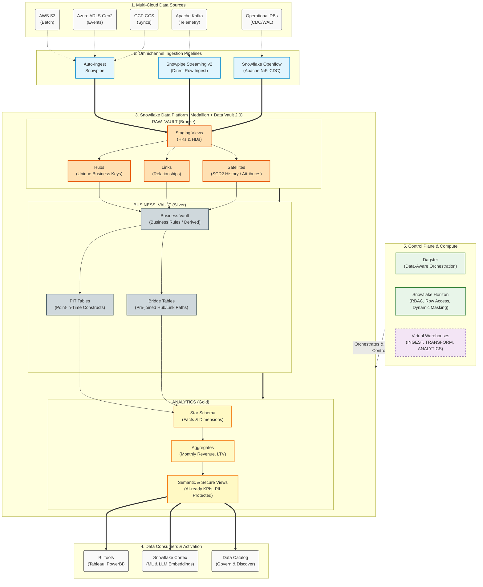

# Architecture Guide — Data Vault 2.0 Snowflake Data Platform

## Executive Summary

This document describes the architecture of a **production-grade, multi-cloud data platform** deployed on Snowflake across 5-7 regions spanning AWS, Azure, and GCP. The platform implements a hybrid **Medallion + Data Vault 2.0** modeling approach, 5-pipeline omnichannel ingestion, and enterprise governance via Snowflake Horizon.

---

## High-Level Architecture Diagram

---

## Architecture Principles

| Principle | Implementation |
|---|---|
| **Immutability** | Bronze layer is append-only; raw data is never mutated |
| **Separation of Concerns** | Compute (warehouses), storage (databases), access (RBAC) are fully decoupled |
| **Schema-on-Read** | Raw data lands in native format (JSON, Parquet, Avro); structure applied at staging |
| **Incremental Processing** | Hubs/Links/Satellites use `append` strategy; satellites only insert changed records |
| **Defense in Depth** | Network policies → RBAC → Row Access → Column Masking → Encryption |
| **Infrastructure as Code** | All Snowflake objects provisioned via Terraform; no manual DDL in production |
| **Data-Aware Orchestration** | Dagster treats data assets (not tasks) as primary citizens |

---

## 4-Database Architecture

The Snowflake data platform is structurally divided into four distinct databases, separating environments by data maturity, governance boundaries, and consumer access patterns. This isolation ensures that raw data cannot be directly accessed by BI consumers, while business logic is isolated from ingestion dependencies.

### 1. RAW_VAULT_DB (Bronze Layer)
The **RAW_VAULT** acts as the immutable system of record. It combines traditional data lakehouse landing zones with strict Data Vault 2.0 raw structures.
- **Purpose**: To ingest and store data in its original format with absolutely **zero business logic** applied. It guarantees complete historical traceability, auditing, and pipeline reproducibility.
- **Key Schemas**: 
  - `STG_LANDING`: Transient schemas where data from external stages/pipes briefly lands. Includes metadata augmentation (`LOAD_DTS`, `RECORD_SOURCE`).
  - `DV_HUBS`, `DV_LINKS`, `DV_SATS`: Persistent Data Vault structures holding hashed keys, relationships, and historized SCD2 attributes.
- **Design Pattern**: Schema-on-read. Data lands as natively (Variant, JSON/Parquet) and is parsed incrementally in staging views.
- **Access Policies**: Restricted strictly to the `INGESTION_ROLE` and `TRANSFORMER_ROLE`. Direct end-user access is explicitly denied.

### 2. BUSINESS_VAULT_DB (Silver Layer)
The **BUSINESS_VAULT** is the enterprise integration and rules layer where standardizations, soft business rules, and read-optimizations are applied to the Raw Vault.
- **Purpose**: To apply enterprise transformations, handle data quality cleansing, compute complex derivations, and construct query-efficient vault models.
- **Key Schemas**:
  - `BV_RULES`: Houses business vault links and satellites containing computed fields (e.g., credit scores, dynamic classifications, RFM calculations).
  - `BV_OPTIMIZATION`: Contains Point-in-Time (PIT) tables and Bridge tables designed to structurally resolve complex Hub-Link-Satellite joins, mitigating standard Data Vault query penalties.
- **Access Policies**: Restricted to `TRANSFORMER_ROLE`. Typically accessed by Data Scientists requiring pre-calculated raw attributes without Kimball-style aggregations.

### 3. ANALYTICS_DB (Gold Layer)
The **ANALYTICS** database is the refined consumption layer, architected specifically for Business Intelligence, ad-hoc exploration, and AI/ML readiness.
- **Purpose**: To provide denormalized, high-performance Data Marts using Kimball dimensional modeling strategies (Star Schemas) and pre-aggregated KPI tables.
- **Key Schemas**:
  - `MARTS_*`: Domain-specific star schemas containing curated facts and dimensions (e.g., `MARTS_FINANCE`, `MARTS_SALES`).
  - `AGGREGATES`: Features Snowflake Dynamic Tables continuously updated for low-latency dashboarding.
  - `SEMANTIC`: Hosts AI-ready metric views integrated with Snowflake Cortex.
  - `SECURE_VIEWS`: Employs Snowflake Horizon features (Row Access Policies, Dynamic Data Masking) to protect PII.
- **Access Policies**: Exposed via `ANALYST_ROLE`, `DATA_SCIENTIST_ROLE`, and `BI_SERVICE_ACCOUNTS`. This is the primary endpoint for human and BI interactions.

### 4. AUDIT_DB (Control Plane)
The **AUDIT** database is the operational heartbeat of the Data Platform, keeping track of metadata, governance configurations, and infrastructural health.
- **Purpose**: To centralize observability, orchestration monitoring, data quality assertions, and financial operations (FinOps).
- **Key Schemas**:
  - `LOGS`: Stores Snowpipe continuous ingestion histories, dbt run execution metrics, and Dagster orchestrated events.
  - `DATA_QUALITY`: The centralized repository for all dbt data test failures and Great Expectations assertions.
  - `FINOPS`: Analyzes warehouse usage dynamically, mapping Snowflake Compute Credits to distinct business domains to enable chargeback models.

**Environment Separation**: 
Each of these databases natively supports environment prefixing (`DEV_`, `STG_`, `PROD_`), strictly enforced by Terraform to guarantee absolute isolation during the CI/CD deployment lifecycle.

---

## 5-Pipeline Omnichannel Ingestion

| Pipeline | Source | Mechanism | Latency | Use Case |
|---|---|---|---|---|
| 1 | AWS S3 | Storage Integration + Auto-Ingest Snowpipe | Minutes | Batch CSV/JSON/Parquet |
| 2 | Azure ADLS Gen2 | Storage Integration + Event Grid → Snowpipe | Minutes | Document staging, archives |
| 3 | GCP GCS | Storage Integration + Pub/Sub → Snowpipe | Minutes | Nightly archival syncs |
| 4 | Apache Kafka | Snowpipe Streaming v2 (Direct Row Ingest) | Sub-second | IoT telemetry, real-time events |
| 5 | Operational DBs | Snowflake Openflow (Apache NiFi CDC) | Near real-time | PostgreSQL WAL, Oracle XStream |

### Kafka Streaming v2 Design Decisions

- **Direct row ingest**: Bypasses cloud storage entirely (no S3/ADLS staging)
- **Deterministic channel naming**: `{source}-{env}-{topic}-{partition}` for automated recovery
- **Offset token tracking**: `getLatestCommittedOffsetToken()` ensures exactly-once delivery
- **Dead letter queue**: Failed records routed to `snowflake-dlq` topic for investigation

---

## Medallion + Data Vault 2.0 Hybrid

### Bronze Layer (Raw Vault)

| Component | Count | Pattern |
|---|---|---|
| Staging Models | 4 | Views with hash keys (`HK_*`) and hash diffs (`HD_*`) |
| Hubs | 3 | Incremental, insert-only, deduplicated by hash key |
| Links | 2 | Composite hash keys, insert-only |
| Satellites | 6 | SCD Type 2 via hash diff change detection |
| Effectivity Sats | 1 | Tracks relationship validity (cancelled/returned) |

### Silver Layer (Business Vault)

| Component | Count | Purpose |
|---|---|---|
| Business Vault | 2 | RFM scoring, customer LTV/churn, order lifecycle |
| PIT Tables | 2 | LATERAL join for point-in-time lookups |
| Bridge Tables | 1 | Pre-joined link paths with effectivity |
| Conformed | 2 | Denormalized integration for Gold consumption |

### Gold Layer (Analytics)

| Component | Count | Purpose |
|---|---|---|
| Facts | 2 | `fct_orders`, `fct_order_items` |
| Dimensions | 3 | `dim_customer`, `dim_product`, `dim_date` (date spine) |
| Aggregates | 2 | Monthly revenue, customer LTV |
| Semantic Views | 3 | AI-ready metric definitions for Cortex |
| Secure Views | 1 | PII-protected customer profiles for BI |

---

## Compute Architecture (5 Warehouses)

| Warehouse | Size (Prod) | Scaling | Purpose |
|---|---|---|---|
| `INGESTION_WH` | MEDIUM | 1-3 clusters | Snowpipe, streaming, CDC |
| `TRANSFORMER_WH` | LARGE | 1-4 clusters | dbt transformations |
| `ANALYTICS_WH` | MEDIUM | 1-6 clusters (ECONOMY) | BI dashboards, ad-hoc |
| `DEV_WH` | XSMALL | Single | Developer sandbox |
| `CI_WH` | SMALL | Single | CI/CD ephemeral builds |

---

## Trade-offs and Design Decisions

| Decision | Alternative Considered | Rationale |
|---|---|---|
| Data Vault 2.0 over Star Schema (Silver) | Direct star schema | DV provides auditable history, source-agnostic integration, and resilience to schema changes |
| Dagster over Airflow | Airflow (retained as alternative) | Dagster's SDA paradigm provides data-aware orchestration that can halt downstream assets on anomalies |
| SHA-256 over MD5 | MD5 (faster) | SHA-256 provides production-grade collision resistance; performance difference is negligible at our scale |
| PIT via LATERAL join | Window function PIT | LATERAL join is 3-5x faster on Snowflake for large satellite tables |
| Satellite splitting | Single satellite per entity | Splitting by change velocity minimizes storage and speeds incremental loads |
| Semantic Views | BI-embedded metrics | Centralized KPI definitions prevent conflicting metric logic across tools |

---

## Scalability Considerations

- **Horizontal scaling**: Multi-cluster warehouses auto-scale under load (ECONOMY policy for analytics, STANDARD for ETL)
- **Incremental processing**: All satellite/fact models are incremental — only changed rows are processed
- **Parallel execution**: dbt dependency graph enables parallel model execution across independent branches
- **Tiered replication**: Critical data replicates every 10 min; archives replicate daily (reduces egress costs)
- **Search optimization**: Applied on frequently queried fact/dim columns for sub-second query performance
