# CI/CD Guide

## Pipeline Overview

```mermaid
graph LR
    PR["Pull Request"] --> LINT["SQLFluff Lint"]
    LINT --> CI["Slim CI Build<br>(state:modified)"]
    CI --> TEST["dbt Test<br>(modified models)"]
    TEST --> REVIEW["Peer Review"]
    REVIEW --> MERGE["Merge to main"]
    MERGE --> DEPLOY_B["Deploy Bronze"]
    DEPLOY_B --> TEST_B["Test Bronze ✓"]
    TEST_B --> DEPLOY_S["Deploy Silver"]
    DEPLOY_S --> TEST_S["Test Silver ✓"]
    TEST_S --> DEPLOY_G["Deploy Gold"]
    DEPLOY_G --> TEST_G["Test Gold ✓"]
    TEST_G --> DOCS["Generate Docs"]
```



---

## 3 GitHub Actions Workflows

### 1. dbt CI/CD (`dbt_ci_cd.yml`)

**PR Trigger**: `models/`, `macros/`, `tests/`, `seeds/`, `snapshots/`

| Stage | Action | Environment |
|---|---|---|
| Lint | SQLFluff with `--dialect snowflake` | N/A |
| CI Build | `dbt build --select state:modified+` | `ci` (ephemeral schema) |
| Production | Sequential: Bronze → test → Silver → test → Gold → test | `prod` |

**Slim CI Benefits**:
- Only builds/tests models changed in the PR + downstream dependents
- Compares against `main` branch manifest
- Reduces CI credit consumption by ~70%

### 2. Terraform CI/CD (`terraform_ci_cd.yml`)

| Event | Action |
|---|---|
| PR | `fmt -check` → `validate` → `plan` (posted as PR comment) |
| Merge | `apply -auto-approve` with manual release gate |

### 3. Data Quality Report (`data_quality_report.yml`)

- **Schedule**: Every Monday 08:00 UTC
- **Action**: Query `AUDIT.DQ_RESULTS`, generate markdown report, auto-create GitHub Issue for failures

---

## Environment Promotion

```
feature/* → develop → staging → main (production)
   └── CI schema (ephemeral)   └── staging schema   └── production schema
```

1. Developer branches from `develop`, writes models
2. PR triggers CI build in ephemeral `ci_{run_id}` schema
3. After review, merges to `develop` → triggers staging deploy
4. After validation, PR from `develop` to `main` → production deploy with test gates

---

## Secrets Management

| Secret | Used By | Storage |
|---|---|---|
| `SNOWFLAKE_ACCOUNT` | dbt CI/CD, DQ Report | GitHub Secrets |
| `SNOWFLAKE_USER` | dbt CI/CD | GitHub Secrets |
| `SNOWFLAKE_PASSWORD` | dbt CI/CD | GitHub Secrets |
| `TF_SNOWFLAKE_USER` | Terraform | GitHub Secrets |
| `TF_SNOWFLAKE_PRIVATE_KEY_PATH` | Terraform | GitHub Secrets (RSA PEM) |
