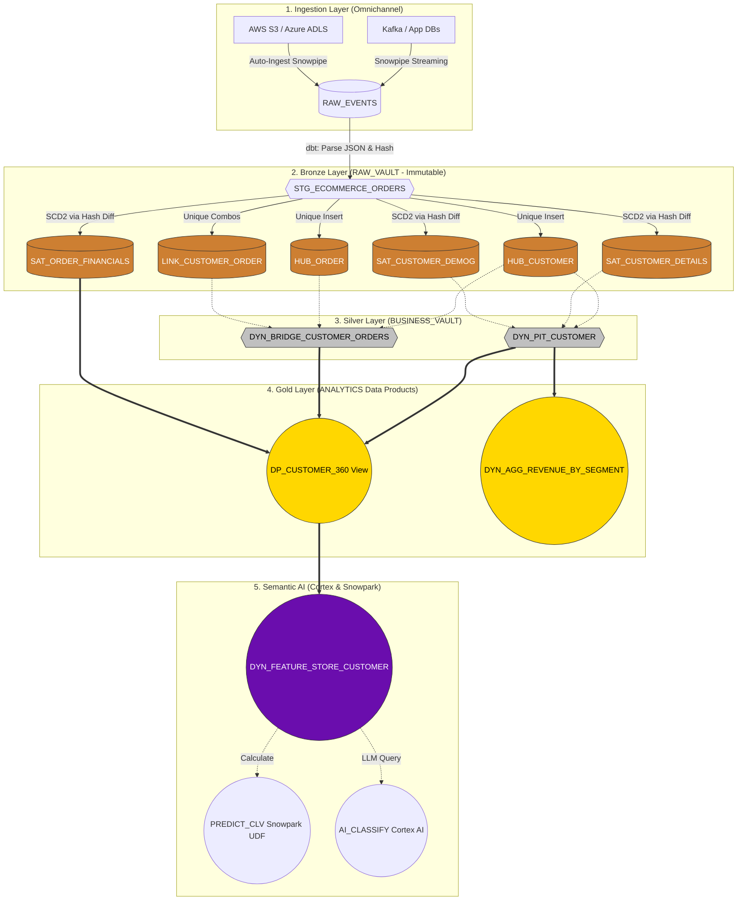

# Data Processing & Transformation Walkthrough
**Platform:** Multi-Cloud Snowflake Data Vault 2.0  
**Scope:** Source systems through Bronze, Silver, Gold, and AI Semantic Layers.

This document serves as the canonical guide demonstrating **exactly how and where data is transformed**, complete with logical diagrams, mechanical formulas, and rich tabular sample data detailing the exact lifecycle of records.

---

## 1. System Logical Flow Architecture

This diagram illustrates the boundaries of the platform and the precise mechanisms moving data between layers.

---

## 2. Walkthrough Scenario & Sample Data

We will track two users across two days to demonstrate ingestion, normalization, and SCD Type 2 history tracking.

* **Day 1**: Alice (`C100`) buys a mouse; Bob (`C200`) buys a keyboard.
* **Day 2**: Alice upgrades her loyalty tier to `PLATINUM` and changes her email.

### Step 1: Ingestion (RAW_EVENTS)
**Location:** `RAW_VAULT.ECOMMERCE.RAW_EVENTS`  
**Tooling:** Snowpipe Streaming Kafka Connector / AWS S3 Auto-Ingest.  
**Transformation applied:** None. Strict schema-on-read. Data is immutable.

| EVENT_ID | INGESTED_AT | SOURCE | RAW_JSON_PAYLOAD |
|---|---|---|---|
| `e01` | `2026-04-23 10:00` | Kafka | `{ "customer_id": "C100", "first_name": "Alice", "email": "ali@m.com", "loyalty_tier": "GOLD", "order_id": "O999", "amount": 25.0 }` |
| `e02` | `2026-04-23 10:05` | Kafka | `{ "customer_id": "C200", "first_name": "Bob", "email": "bob@m.com", "loyalty_tier": "SILVER", "order_id": "O555", "amount": 90.0 }` |
| `e03` | `2026-04-24 09:00` | S3_CRM | `{ "customer_id": "C100", "first_name": "Alice", "email": "alice_new@m.com", "loyalty_tier": "PLATINUM", "order_id": null, "amount": null }` |

---

### Step 2: Staging & Hashing (dbt views)
**Location:** `RAW_VAULT.STAGING.STG_ECOMMERCE_ORDERS`  
**Tooling:** dbt models relying on `dbt_utils.generate_surrogate_key`.  
**Transformation applied:** 
1. `PARSE_JSON` to flatten payloads.
2. Typecasting (`::VARCHAR`, `::FLOAT`).
3. Hash String Generation.

**How Hashing Works:**
* **HK_CUSTOMER (Hash Key):** `SHA256(COALESCE(UPPER(TRIM(customer_id)), ''))`
* **HD_CUST_DEMO (Hash Diff - Demographics):** `SHA256(COALESCE(UPPER(TRIM(loyalty_tier)), '^^'))` *(Where `^^` is a null-handling sentinel)*

| EVENT_ID | CUSTOMER_ID | EMAIL | TIER | HK_CUSTOMER | HD_CUST_DETAILS | HD_CUST_DEMO |
|---|---|---|---|---|---|---|
| `e01` (D1) | C100 | ali@m.com | GOLD | `1a2b3c` | `x9y8z7` | `m1n2o3` |
| `e02` (D1) | C200 | bob@m.com | SILVER | `9z8y7x` | `p1q2r3` | `w9x8y7` |
| `e03` (D2) | C100 | alice_new... | PLATINUM | `1a2b3c` | `a7b8c9` | `j4k5l6` |

> *Notice: In `e03`, Alice's `HK_CUSTOMER` remains `1a2b3c` because her ID didn't change, but her Hash Diffs physically changed because her payload values changed.*

---

### Step 3: Bronze Layer Data Vault Splitting
**Location:** `RAW_VAULT.RAW_VAULT.*`  
**Tooling:** dbt incremental models.

#### Hubs (Entities)
**Rule:** Only insert if `HK` is completely new. No duplicates allowed.  
*On Day 1, Alice and Bob are inserted. On Day 2, `e03` is IGNORED because `1a2b3c` already exists.*

| HK_CUSTOMER | CUSTOMER_ID | LOAD_DATETIME | RECORD_SOURCE |
|---|---|---|---|
| `1a2b3c` | C100 | `2026-04-23 10:00` | Kafka |
| `9z8y7x` | C200 | `2026-04-23 10:05` | Kafka |

#### Links (Relationships)
**Rule:** Unique combination of interacting Hub Hash Keys.

| HK_LINK_CUST_ORD | HK_CUSTOMER | HK_ORDER | LOAD_DATETIME |
|---|---|---|---|
| `a1b2c3` | `1a2b3c` (Alice) | `9f8e7d` (O999) | `2026-04-23 10:00` |
| `d4e5f6` | `9z8y7x` (Bob) | `5a4b3c` (O555) | `2026-04-23 10:05` |

#### Satellites (SCD Type 2 History)
**Rule:** Insert new record ONLY if the incoming `HASH_DIFF` does not match the latest `HASH_DIFF` for that `HK_CUSTOMER`.

**SAT_CUSTOMER_DETAILS** (High-Velocity changes like Email)

| HK_CUSTOMER | LOAD_DATETIME | HASH_DIFF | FIRST_NAME | EMAIL | STATUS |
|---|---|---|---|---|---|
| `1a2b3c` | `2026-04-23 10:00` | `x9y8z7` | Alice | ali@m.com | *Active on Day 1* |
| `9z8y7x` | `2026-04-23 10:05` | `p1q2r3` | Bob | bob@m.com | *Active on Day 1* |
| `1a2b3c` | `2026-04-24 09:00` | `a7b8c9` | Alice | **alice_new@m.com** | *Inserted on Day 2 due to Hash Diff mismatch!* |

**SAT_CUSTOMER_DEMOGRAPHICS** (Low-Velocity changes like Tier)

| HK_CUSTOMER | LOAD_DATETIME | HASH_DIFF | LOYALTY_TIER | STATUS |
|---|---|---|---|---|
| `1a2b3c` | `2026-04-23 10:00` | `m1n2o3` | GOLD | *Active on Day 1* |
| `9z8y7x` | `2026-04-23 10:05` | `w9x8y7` | SILVER | *Active on Day 1* |
| `1a2b3c` | `2026-04-24 09:00` | `j4k5l6` | **PLATINUM** | *Inserted on Day 2 due to Hash Diff mismatch!* |

---

### Step 4: Silver Layer Point-in-Time (PIT) Optimization
**Location:** `BUSINESS_VAULT.PIT_TABLES.*`  
**Tooling:** Snowflake Dynamic Tables.  
**Transformation:** A standard Data Vault requires massive `JOIN` operations across satellites to find the "active" record at a point in time. The `DYN_PIT_CUSTOMER` table autonomously manages pointers mapping a Hub to the exact temporal timestamp of its satellites.

**DYN_PIT_CUSTOMER** (After Day 2 updates are processed)

| HK_CUSTOMER | CUSTOMER_ID | PIT_LOAD_DATETIME | SAT_DETAILS_LOAD_DT | SAT_DEMO_LOAD_DT |
|---|---|---|---|---|
| `1a2b3c` (Alice)| C100 | `2026-04-24 09:10` | `2026-04-24 09:00` *(Points to new email)* | `2026-04-24 09:00` *(Points to PLATINUM)* |
| `9z8y7x` (Bob)  | C200 | `2026-04-24 09:10` | `2026-04-23 10:05` | `2026-04-23 10:05` |

---

### Step 5: Gold Layer (Data Products & Security)
**Location:** `ANALYTICS.SECURE_VIEWS.*`  
**Tooling:** Snowflake Secure Views mapped via Terraform RBAC.  
**Transformation:** Denormalization into wide tables for human BI consumption. Dynamic Data Masking policies enforce security rules exactly at query-time.

**DP_CUSTOMER_360** (When queried by a BI tool using `ANALYST` role)

| CUSTOMER_ID | FIRST_NAME | EMAIL | LOYALTY_TIER | LIFETIME_REVENUE |
|---|---|---|---|---|
| C100 | Alice | a\*\*\*@m.com | PLATINUM | 25.0 |
| C200 | Bob | b\*\*\*@m.com | SILVER | 90.0 |

> *Note: By querying this view, the engine looks at the PIT table, grabs the exact satellite keys, performs O(1) lookups against the Satellites, aggregates the `SAT_ORDER_FINANCIALS` associated with the Link table, and passes the Email through the `MASK_EMAIL` governance policy.*

---

### Step 6: Semantic AI & ML Feature Store
**Location:** `ANALYTICS.SEMANTIC_VIEWS.*`  
**Tooling:** Snowpark Python UDFs & Snowflake Cortex LLMs.  
**Transformation:** The Data Platform enriches raw analytics with Artificial Intelligence instantaneously, without pipelines extracting data to external systems.

**DYN_FEATURE_STORE_CUSTOMER** (Refreshes hourly via Native Scheduling)

| CUSTOMER_ID | TIER | FEATURE_LIFETIME_REV | PREDICTED_CLV *(Snowpark ML)* | AI_CUSTOMER_CLASS *(Cortex LLM)*| AI_SUMMARY *(Cortex LLM)* |
|---|---|---|---|---|---|
| C100 | PLATINUM | 25.0 | **315.50** | `GROWTH` | "Alice is in segment PLATINUM..."|
| C200 | SILVER | 90.0 | **110.20** | `AT_RISK` | "Bob is in segment SILVER with..."|

**Underlying mechanics:**
1. **PREDICT_CLV:** A Python 3.11 UDF (compiled as a secure Sandbox in Snowflake) receives `(LIFETIME_REVENUE, TIER)`, runs a BG/NBD probability equation using `numpy`, and returns a float. 
2. **AI_CUSTOMER_CLASS:** `SNOWFLAKE.CORTEX.CLASSIFY_TEXT` is invoked natively, utilizing an LLM to categorize the unstructured context string generated by the user's current status and history into a precise segment array.
