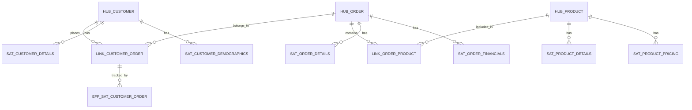

# Data Vault 2.0 Design Guide

## Executive Summary

Data Vault 2.0 is an architectural framework providing a **detail-oriented, historically tracked, and uniquely linked** set of normalized tables that support enterprise-wide Business Intelligence. Within the Medallion architecture, this platform leverages DV2.0 exclusively as the Silver Layer to guarantee historical accuracy, agile integration, and massive scalability.

---

## Entity Relationship Model



---

## Hashing Strategy

> [!IMPORTANT]  
> All hash keys and hash diffs utilize `SHA-256` via the `dbt_utils.generate_surrogate_key` macro. Do not use MD5, as SHA-256 is required for enterprise collision resistance.

### Hash Key (HK_*)
- **Algorithm**: SHA-256
- **Input**: Business key columns, pipe-separated (`||`), NULL coalesced to `''` (empty string).
- **Purpose**: A strictly deterministic surrogate key identifying a unique business entity.

### Hash Diff (HD_*)
- **Algorithm**: SHA-256
- **Input**: All descriptive attribute columns, pipe-separated, NULL coalesced to `^^` (sentinel value).
- **Purpose**: Change detection mechanism. The pipeline only inserts new satellite rows when an incoming hash diff disagrees with the active historical row.

### Ghost Record
- **Hash**: `0000000000000000000000000000000000000000000000000000000000000000`
- **Date**: `1900-01-01`
- **Purpose**: Prevents outer joins. Represents unknown or NULL foreign key references within Links and Hubs.

---

## Component Patterns

### Hub Pattern
```sql
-- Insert-only, deduplicated by hash key, earliest record wins
SELECT HK_CUSTOMER, CUSTOMER_ID, LOAD_DATETIME, RECORD_SOURCE
FROM staging
QUALIFY ROW_NUMBER() OVER (PARTITION BY HK_CUSTOMER ORDER BY LOAD_DATETIME ASC) = 1
WHERE HK_CUSTOMER NOT IN (SELECT HK_CUSTOMER FROM hub_customer)  -- Incremental filter
```

### Satellite Pattern (SCD Type 2)
```sql
-- Only inserts when a physical attribute change is detected
SELECT stg.*
FROM staging stg
LEFT JOIN (latest satellite record) lr ON stg.HK = lr.HK
WHERE lr.HK IS NULL OR stg.HASH_DIFF != lr.HASH_DIFF  -- Change detection logic
```

### PIT Table Pattern (LATERAL Join)
```sql
-- Point-in-time lookup using Snowflake LATERAL for optimal performance
SELECT hub.HK, hub.PIT_LOAD_DATETIME, sat.LOAD_DATETIME
FROM hub
LEFT JOIN LATERAL (
    SELECT LOAD_DATETIME FROM satellite
    WHERE HK = hub.HK AND LOAD_DATETIME <= hub.PIT_LOAD_DATETIME
    ORDER BY LOAD_DATETIME DESC LIMIT 1
) sat
```

> [!TIP]
> **Performance Optimization**  
> Snowflake `LEFT JOIN LATERAL` performs 3-5x faster than traditional `WINDOW` functions or standard `JOIN` operations when querying multi-billion row satellites for Point-In-Time constructions.

---

## Satellite Splitting Strategy

| Entity | Satellite 1 (High Velocity) | Satellite 2 (Low Velocity) |
|---|---|---|
| Customer | `SAT_CUSTOMER_DETAILS` (name, email, phone, address) | `SAT_CUSTOMER_DEMOGRAPHICS` (age, income, segment) |
| Order | `SAT_ORDER_DETAILS` (status, dates, shipping) | `SAT_ORDER_FINANCIALS` (amounts, tax, discount) |
| Product | `SAT_PRODUCT_DETAILS` (name, category, brand) | `SAT_PRODUCT_PRICING` (price, cost, margin) |

> [!NOTE]  
> **Rationale:** Attributes that change at significantly different frequencies are segregated into separate satellites. This limits massive duplication of static columns when only a single volatile column (e.g., `status`) changes.

---

## Naming Conventions

Strict adherence to naming conventions ensures automation macros successfully parse our Data Vault components without manual intervention.

| Object Category | Pattern Formula | Example Specification |
|---|---|---|
| **Hub** | `HUB_{entity}` | `HUB_CUSTOMER` |
| **Link** | `LINK_{entity1}_{entity2}` | `LINK_CUSTOMER_ORDER` |
| **Satellite** | `SAT_{entity}_{descriptor}` | `SAT_CUSTOMER_DETAILS` |
| **Effectivity Sat** | `EFF_SAT_{link}` | `EFF_SAT_CUSTOMER_ORDER` |
| **Hash Key** | `HK_{entity}` | `HK_CUSTOMER` |
| **Hash Diff** | `HD_{satellite}` | `HD_CUSTOMER_DETAILS` |
| **PIT Table** | `PIT_{entity}` | `PIT_CUSTOMER` |
| **Bridge** | `BRIDGE_{link}` | `BRIDGE_CUSTOMER_ORDER` |
| **Business Vault**| `BV_{descriptor}` | `BV_CUSTOMER_CLASSIFICATION` |
| **Staging** | `STG_{source}__{entity}` | `STG_ECOMMERCE__CUSTOMERS` |
