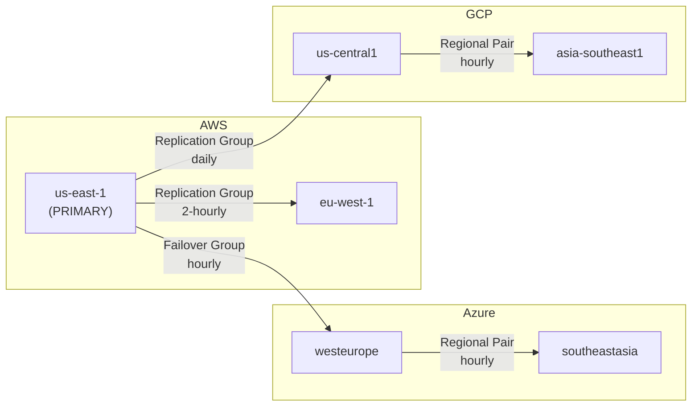

# Multi-Cloud & Multi-Region Strategy

## Overview

The platform is architected for deployment across **5-7 regions** spanning **AWS, Azure, and GCP** using Snowflake's native cross-cloud replication and failover capabilities.

---

## Regional Topology



---

## Failover Group Design

### Dangling Reference Prevention

All dependent objects are co-located within the SAME failover group:

```
FG_DATA_PLATFORM includes:
├── DATABASES: RAW_VAULT, BUSINESS_VAULT, ANALYTICS, AUDIT
├── ROLES: All 6 functional roles
├── WAREHOUSES: All 5 warehouses
├── NETWORK POLICIES: Platform network policy
└── INTEGRATIONS: Storage integrations
```

> **CRITICAL**: If masking policies in `RAW_VAULT.GOVERNANCE` are NOT in the same failover group as `RAW_VAULT.ECOMMERCE` tables, replication will FAIL with dangling reference errors.

---

## Tiered Replication Frequency (FinOps)

| Tier | Data | Frequency | Rationale |
|---|---|---|---|
| **Tier 1 (Critical)** | RAW_VAULT (Hubs, active Sats) | Every 10 minutes | Business-critical, minimal data loss tolerance |
| **Tier 2 (Standard)** | BUSINESS_VAULT, ANALYTICS | Hourly | Acceptable for BI refresh cadence |
| **Tier 3 (Archive)** | AUDIT, historical Sats | Daily | High volume, low urgency, reduces egress costs |

---

## 3 Continuity Strategies

### Strategy 1: Reads Before Writes
- **When**: Brief localized outages (< 1 hour expected)
- **Action**: Redirect clients to read-only replicas immediately
- **Impact**: Dashboards remain live; ingestion paused
- **RPO**: Minutes | **RTO**: Seconds

### Strategy 2: Writes Before Reads
- **When**: Extended outages requiring data integrity guarantee
- **Action**: Promote failover group → run reconciliation ETL → redirect clients
- **Impact**: Reporting paused during reconciliation; zero data loss
- **RPO**: Zero | **RTO**: Minutes to hours

### Strategy 3: Simultaneous Failover
- **When**: Critical outages requiring immediate full recovery
- **Action**: Promote failover group AND redirect clients concurrently
- **Impact**: Consumers may see slightly stale data during Kafka offset reconciliation
- **RPO**: Seconds | **RTO**: Near-zero

---

## Client Redirect

Snowflake Client Redirect provides a **unified connection URL** that automatically repoints to the promoted primary account during failover. All downstream applications, BI tools, and pipelines are agnostic to the infrastructure change.

```sql
ALTER CONNECTION DATA_PLATFORM_CONNECTION
    ENABLE FAILOVER TO ACCOUNTS org.secondary_1, org.secondary_2;
```

---

## Data Residency Compliance

- **Row Access Policies**: Country-based filtering ensures analysts only see data for their assigned region
- **Data Classification**: `SYSTEM$CLASSIFY` auto-detects PII columns and applies governance tags
- **Replication Boundaries**: Regional pairs ensure EU data stays within EU regions for GDPR compliance
