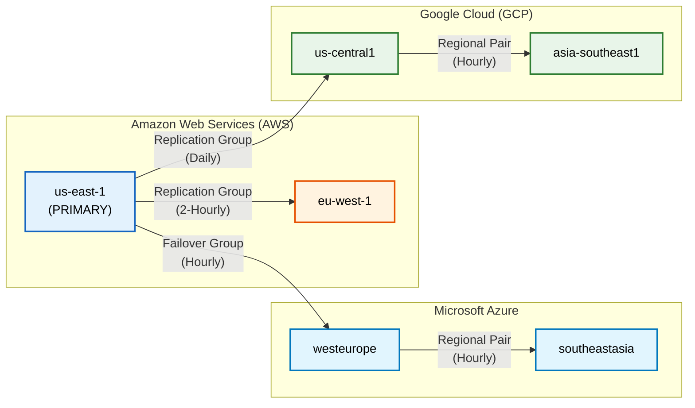

# Multi-Cloud & Multi-Region Strategy

## Executive Summary

The platform is architected for maximum resilience, deploying across **5-7 regions** spanning **AWS, Azure, and GCP**. It relies on Snowflake's native cross-cloud replication and automated failover capabilities to ensure zero downtime and strict data residency compliance for global operations.

---

## Regional Topology



---

## Failover Group Design

### Dangling Reference Prevention

All dependent objects must be completely co-located within the **SAME** failover group to guarantee seamless promotion during an outage.

```
FG_DATA_PLATFORM includes:
├── DATABASES: RAW_VAULT, BUSINESS_VAULT, ANALYTICS, AUDIT
├── ROLES: All 6 functional roles
├── WAREHOUSES: All 5 virtual warehouses
├── NETWORK POLICIES: Platform network policy
└── INTEGRATIONS: Storage integrations (S3/ADLS/GCS)
```

> [!CAUTION]
> **Dangling Reference Error Risk!**
> If masking policies located in `RAW_VAULT.GOVERNANCE` are NOT placed in the identical failover group as the `RAW_VAULT.ECOMMERCE` tables utilizing them, replication processes will **FAIL** with dangling reference errors, compromising disaster recovery setups.

---

## Tiered Replication Frequency (FinOps)

To balance Disaster Recovery parameters (RPO/RTO) against egress costs, replication operates on tiered frequencies.

| Tier | Data Layer | Frequency | FinOps Rationale |
|---|---|---|---|
| **Tier 1 (Critical)** | RAW_VAULT (Hubs, active Sats) | Every 10 minutes | Business-critical; minimal tolerance for data loss. |
| **Tier 2 (Standard)** | BUSINESS_VAULT, ANALYTICS | Hourly | Sufficiently acceptable for standard BI refresh cadences. |
| **Tier 3 (Archive)** | AUDIT, historical Sats | Daily | High volume, low urgency. Significantly reduces cloud egress costs. |

---

## 3 Continuity Strategies

### Strategy 1: Reads Before Writes
- **When**: Brief localized region outages (< 1 hour expected).
- **Action**: Redirect clients to read-only replicas immediately. Dashboards remain live while ingestion pauses.
- **RPO**: Minutes
- **RTO**: Seconds

### Strategy 2: Writes Before Reads
- **When**: Extended outages demanding guaranteed data integrity.
- **Action**: Promote the failover group → Run reconciliation ETL → Redirect clients.
- **RPO**: Zero
- **RTO**: Minutes to Hours

### Strategy 3: Simultaneous Failover
- **When**: Catastrophic outages requiring immediate full recovery.
- **Action**: Promote failover group AND redirect clients concurrently.
- **RPO**: Seconds (Consumers may see slightly stale data during Kafka offset reconciliation).
- **RTO**: Near-Zero

---

## Client Redirect

Snowflake Client Redirect provides a **unified connection URL** that automatically repoints to the promoted primary account during failover. All downstream applications, BI tools, and pipelines remain entirely agnostic to the underlying infrastructure flip.

```sql
ALTER CONNECTION DATA_PLATFORM_CONNECTION
    ENABLE FAILOVER TO ACCOUNTS org.secondary_1, org.secondary_2;
```

---

## Data Residency Compliance

- **Row Access Policies**: Mandatory country-based filtering ensures analysts only query data mapped to their assigned region.
- **Data Classification**: `SYSTEM$CLASSIFY` systematically detects PII columns and physically attaches Horizon governance tags.
- **Replication Boundaries**: Dedicated Regional Pairs physically guarantee that EU data stays restricted strictly within EU regions, ensuring uncompromising GDPR compliance.
