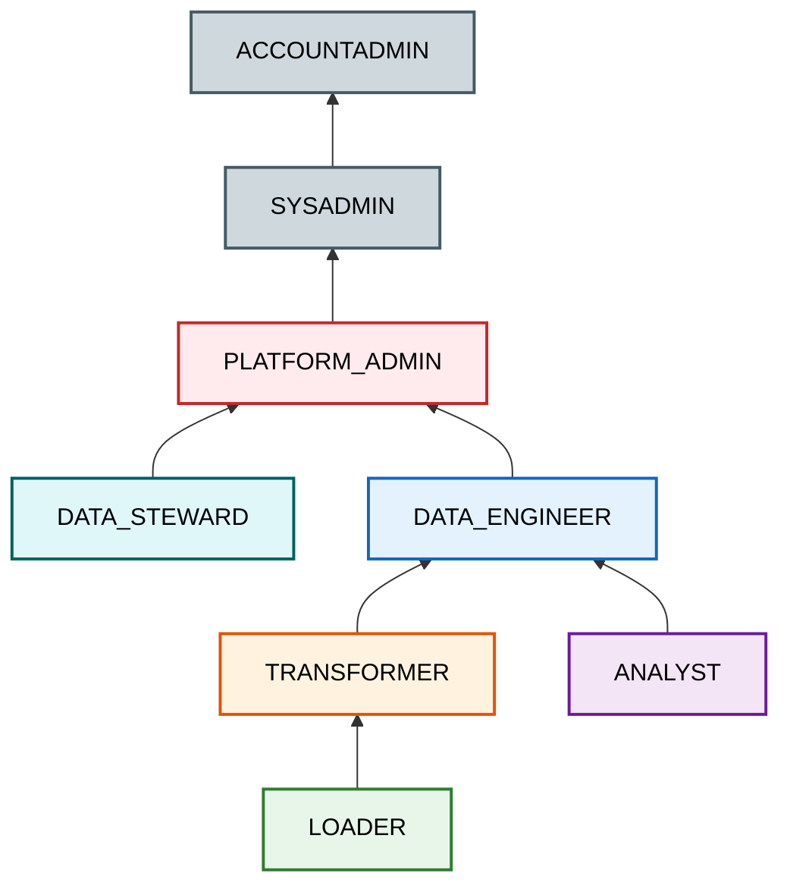

# Security & Governance Guide

## Executive Summary

The platform implements **Snowflake Horizon** as its centralized governance control plane. Security policies—including Dynamic Data Masking, Row Access Policies, and Object Tagging—are defined natively and propagate automatically across all multi-cloud regions via failover group replication.

---

## RBAC Hierarchy (6 Roles)

The Role-Based Access Control (RBAC) model enforces the principle of least privilege, mapping functional tasks directly to custom Snowflake roles.

| Role | Access Profile | Primary Purpose |
|---|---|---|
| `LOADER` | Write to RAW_VAULT landing tables | Snowpipe, streaming ingestion |
| `TRANSFORMER` | Read RAW_VAULT, write BUSINESS_VAULT + ANALYTICS | dbt data transformations |
| `DATA_ENGINEER` | Full read/write on all data databases | Pipeline construction & debugging |
| `ANALYST` | Read ANALYTICS (Gold only), filtered strictly by RAPs | BI dashboards, ad-hoc discovery |
| `DATA_STEWARD` | Apply tags, masking, and row access policies | Governance metadata administration |
| `PLATFORM_ADMIN` | All of the above + Terraform IaC creation | Core Infrastructure management |

---

## Dynamic Data Masking (6 Policies)

> [!NOTE]
> Masking policies dynamically render obfuscated strings at query-time based on the invoking user's role, meaning the underlying storage safely retains the raw unmasked data.

| Logical Policy | PII Data Type | Privileged Unmasked Roles | Masked Output Visualization |
|---|---|---|---|
| `MASK_EMAIL` | Email | DATA_ENGINEER, PLATFORM_ADMIN | `ha***@domain.com` |
| `MASK_PHONE` | Phone | DATA_ENGINEER, PLATFORM_ADMIN | `***-***-1234` |
| `MASK_NAME` | Name | DATA_ENGINEER, PLATFORM_ADMIN, DATA_STEWARD | `J****` |
| `MASK_SSN` | SSN | PLATFORM_ADMIN only | `***-**-****` |
| `MASK_DOB` | Date of Birth | DATA_ENGINEER, PLATFORM_ADMIN, DATA_STEWARD | `1990-01-01` |
| `MASK_ADDRESS`| Address | DATA_ENGINEER, PLATFORM_ADMIN, DATA_STEWARD | `*** REDACTED ***` |

---

## Tag-Based Governance (5 Tag Types)

Object tagging provides hierarchical metadata classification, driving automated policy inheritance.

| Tag Category | Allowed Values | Operational Purpose |
|---|---|---|
| `PII` | EMAIL, PHONE, SSN, NAME, ADDRESS, DOB | Drives the automatic mapping of masking policies |
| `SENSITIVITY_LEVEL` | PUBLIC, INTERNAL, CONFIDENTIAL, RESTRICTED | Dictates broad environment access tier classifications |
| `DATA_DOMAIN` | CUSTOMER, ORDER, PRODUCT, FINANCIAL | Orchestrates data lineage and stewardship ownership |
| `COST_CENTER` | ENGINEERING, DATA_SCIENCE, BI_ANALYTICS | Ensures pristine FinOps credit usage attribution |
| `RETENTION_CLASS` | EPHEMERAL, SHORT_TERM, STANDARD, LONG_TERM, REGULATORY | Controls Time Travel and Fail-safe retention days |

---

## Row Access Policies (RAPs)

| Policy Definition | Filter Column | Execution Logic |
|---|---|---|
| `RAP_COUNTRY_FILTER` | `COUNTRY_CODE` | Analysts see only their strictly assigned geographical region; engineers view all global data. |
| `RAP_SENSITIVITY_FILTER`| `SENSITIVITY_LEVEL`| Analysts are confined to PUBLIC/INTERNAL models; CONFIDENTIAL access fundamentally requires engineer privileges. |

---

## Automated Data Classification

> [!TIP]
> **Proactive Discovery**
> Leveraging `SYSTEM$CLASSIFY`, the platform programmatically analyzes raw staging tables and proactively discovers un-declared PII without human intervention.

`SYSTEM$CLASSIFY` runs natively on all raw landing tables leveraging standard regex classifiers:
- **Email**: `^[a-zA-Z0-9._%+-]+@[a-zA-Z0-9.-]+\.[a-zA-Z]{2,}$`
- **Phone**: `^\+?[1-9]\d{1,14}$`
- **SSN**: `^\d{3}-\d{2}-\d{4}$`

Results automatically assign semantic `PII` and `SEMANTIC_CATEGORY` tags directly to the objects. Anomalies are proactively viewable via `AUDIT.CONTROL.DATA_CLASSIFICATION_REPORT`.

---

## Authentication Protocols

| Connection Context | Authentication Method | Encrypted Key Storage |
|---|---|---|
| **Developer (Local)** | RSA Key-Pair (2048-bit) | `.env` file (local ignore) |
| **CI/CD Pipeline** | RSA Key-Pair (2048-bit) | GitHub Secrets |
| **Terraform IaC** | RSA Key-Pair (2048-bit) | GitHub Secrets / HashiCorp Vault |
| **Production Apps** | RSA Key-Pair (2048-bit) | Encrypted Azure Key Vault |
| **Kafka Connector** | RSA Key-Pair (2048-bit) | Secured Environment variable |
| **Observability Tools** | RSA Key-Pair (Read-Only) | Associated tool-specific vault |

> [!CAUTION]
> **Zero Password Policy!**
> Password-based authentication is fundamentally **PROHIBITED** across all automated pipelines and service accounts. Only RSA Key-Pair (2048-bit minimum) is permitted. Any user attempting basic-auth will trigger identity alerts.
