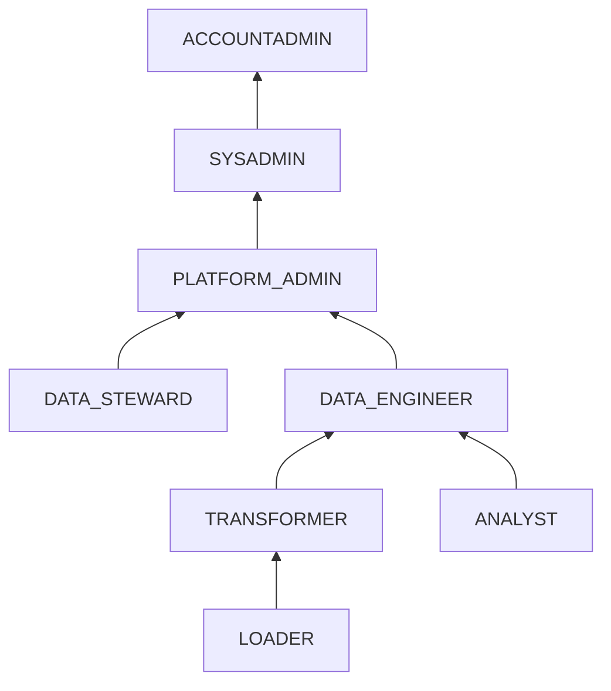

# Security & Governance Guide

## Snowflake Horizon Catalog Integration

The platform implements **Snowflake Horizon** as the centralized governance control plane. Policies are defined ONCE and propagate automatically across all regions via failover group replication.

---

## RBAC Hierarchy (6 Roles)

| Role | Access | Purpose |
|---|---|---|
| `LOADER` | Write to RAW_VAULT landing tables | Snowpipe, streaming ingestion |
| `TRANSFORMER` | Read RAW_VAULT, write BUSINESS_VAULT + ANALYTICS | dbt transformations |
| `DATA_ENGINEER` | Full read/write on all data databases | Pipeline development |
| `ANALYST` | Read ANALYTICS (Gold only), filtered by RAPs | BI dashboards, ad-hoc |
| `DATA_STEWARD` | Apply tags, masking, RAPs | Governance administration |
| `PLATFORM_ADMIN` | All of the above + Terraform IaC | Infrastructure management |

---

## Dynamic Data Masking (6 Policies)

| Policy | PII Type | Privileged Roles | Masked Output |
|---|---|---|---|
| `MASK_EMAIL` | Email | DATA_ENGINEER, PLATFORM_ADMIN | `ha***@domain.com` |
| `MASK_PHONE` | Phone | DATA_ENGINEER, PLATFORM_ADMIN | `***-***-1234` |
| `MASK_NAME` | Name | DATA_ENGINEER, PLATFORM_ADMIN, DATA_STEWARD | `J****` |
| `MASK_SSN` | SSN | PLATFORM_ADMIN only | `***-**-****` |
| `MASK_DOB` | Date of Birth | DATA_ENGINEER, PLATFORM_ADMIN, DATA_STEWARD | `1990-01-01` |
| `MASK_ADDRESS` | Address | DATA_ENGINEER, PLATFORM_ADMIN, DATA_STEWARD | `*** REDACTED ***` |

---

## Tag-Based Governance (5 Tag Types)

| Tag | Values | Purpose |
|---|---|---|
| `PII` | EMAIL, PHONE, SSN, NAME, ADDRESS, DOB | Drives automatic masking policy assignment |
| `SENSITIVITY_LEVEL` | PUBLIC, INTERNAL, CONFIDENTIAL, RESTRICTED | Access tier classification |
| `DATA_DOMAIN` | CUSTOMER, ORDER, PRODUCT, FINANCIAL | Lineage and ownership |
| `COST_CENTER` | ENGINEERING, DATA_SCIENCE, BI_ANALYTICS | Credit usage attribution |
| `RETENTION_CLASS` | EPHEMERAL, SHORT_TERM, STANDARD, LONG_TERM, REGULATORY | Time Travel retention |

---

## Row Access Policies

| Policy | Filter Column | Logic |
|---|---|---|
| `RAP_COUNTRY_FILTER` | `COUNTRY_CODE` | Analysts see only their assigned region; engineers see all |
| `RAP_SENSITIVITY_FILTER` | `SENSITIVITY_LEVEL` | Analysts restricted to PUBLIC/INTERNAL; CONFIDENTIAL requires engineer+ |

---

## Automated Data Classification

`SYSTEM$CLASSIFY` runs on all raw landing tables with custom regex classifiers:
- Email: `^[a-zA-Z0-9._%+-]+@[a-zA-Z0-9.-]+\.[a-zA-Z]{2,}$`
- Phone: `^\+?[1-9]\d{1,14}$`
- SSN: `^\d{3}-\d{2}-\d{4}$`

Results auto-tag columns with `PII` and `SEMANTIC_CATEGORY` tags, viewable via `AUDIT.CONTROL.DATA_CLASSIFICATION_REPORT`.

---

## Authentication

| Context | Method | Key Storage |
|---|---|---|
| Developer (dev) | RSA Key-Pair (2048-bit) | `.env` file (local) |
| CI/CD Pipeline | RSA Key-Pair (2048-bit) | GitHub Secrets |
| Terraform IaC | RSA Key-Pair (2048-bit) | GitHub Secrets / HashiCorp Vault |
| Production (staging/prod) | RSA Key-Pair (2048-bit) | Encrypted key vault |
| Kafka Connector | RSA Key-Pair (2048-bit) | Environment variable |
| Observability Tools | RSA Key-Pair (read-only) | Tool-specific secret store |

> **POLICY**: Password-based authentication is PROHIBITED across all automated pipelines and service accounts. Only RSA Key-Pair (2048-bit minimum) is permitted.
